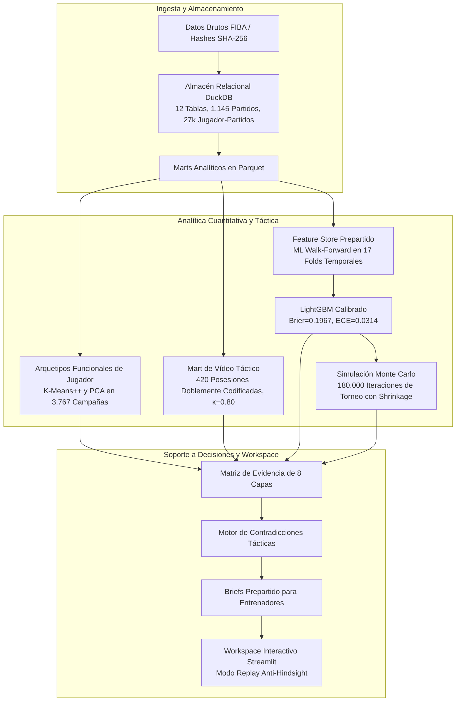

# International Basketball Analytics
### Sistema de análisis y soporte a decisiones para baloncesto internacional (2005–2024)

```text
WHO:         Basketball Data Analyst Portfolio
WHAT:        Sistema de Análisis y Soporte a Decisiones para Baloncesto Internacional
WHY:         Evidencia rigurosa, interpretable y calibrada para cuerpos técnicos y directores deportivos
SCOPE:       18 Torneos (2005–2024: EuroBasket, Copa del Mundo FIBA, Juegos Olímpicos — 1,145 partidos)
TECHNOLOGY:  Python, SQL / DuckDB, Machine Learning, Inferencia Bootstrap, Streamlit
OUTPUT:      Briefs prepartido de 1.5 páginas y Workspace interactivo anti-hindsight
LIMITATION:  Demostración de portfolio (no es un producto comercial en vivo de club)
```

Este repositorio contiene un sistema analítico integral de soporte a decisiones para cuerpos técnicos y directores deportivos, desarrollado sobre dos décadas de competiciones internacionales de selecciones masculinas absolutas (18 torneos oficiales, 1,145 partidos y 27.353 actuaciones de jugador).

$$\text{DATOS} \longrightarrow \text{ANÁLISIS} \longrightarrow \text{EVIDENCIA} \longrightarrow \text{CONTEXTO} \longrightarrow \text{SOPORTE A DECISIONES}$$

[](https://duckdb.org/)
[](https://www.python.org/)
[](R/README.md)
[-brightgreen.svg)](tests/)
[](docs/README.md)
[](portfolio/README.md)

---

## El proyecto en 30 segundos

- **Qué construí**: Una infraestructura analítica dual (Python + R) y DuckDB que transforma actas de partidos y vídeo táctico en briefs prepartido de 1.5 páginas para entrenadores.
- **Qué problema aborda**: En torneos cortos (6–9 partidos en 15 días), la estadística tradicional se distorsiona por la varianza de tiro en muestras pequeñas, y los cuerpos técnicos sufren sobrecarga de datos y sesgo retrospectivo.
- **Qué escala tiene**: 20 años de historia (2005–2024), 18 torneos, 1.145 partidos, 27.353 registros individuales y 1.105 partidos evaluados out-of-sample.
- **Qué tecnologías utiliza**: DuckDB, Parquet, Python (LightGBM, Scikit-Learn, Streamlit), R (tidyverse, ggplot2, Quarto), Inferencia Bootstrap y PCA/K-Means++.
- **Qué tipo de decisiones apoya**: Preparación táctica de partido (coberturas de pick-and-roll, ritmo, espaciado) y evaluación de equilibrio de plantilla por arquetipos funcionales.
- **Qué NO pretende hacer**: No es un producto comercial en vivo, no predice resultados con certeza absoluta ni pretende sustituir la autoridad del entrenador.

---

## El proyecto en cifras

```
+----------------------------------------------------------------------------------------------------+
| MÉTRICA / ENTIDAD            | VALOR AUDITADO Y VERIFICADO EN REPOSITORIO                          |
+----------------------------------------------------------------------------------------------------+
| **Torneos Oficiales**        | 18 Torneos (EuroBasket, Copa del Mundo FIBA, Juegos Olímpicos)      |
| **Partidos Totales**         | 1.145 Partidos internacionales oficiales                            |
| **Observaciones de Equipo**  | 2.290 Filas en `fact_team_game`                                     |
| **Actuaciones de Jugador**   | 27.353 Registros individuales en `fact_player_game`                  |
| **Campañas Cualificadas**    | 3.767 Campañas torneo-jugador (con >= 40 minutos jugados)           |
| **Arquetipos de Jugador**    | 6 Roles funcionales descubiertos con K-Means++ y PCA               |
| **Capa Táctica de Vídeo**    | 420 Posesiones doblemente codificadas (Cohen's κ = 0.80)            |
| **Folds Temporales Walk-FWD**| 17 Folds cronológicos expansivos (1.105 partidos fuera de muestra)  |
| **Calibración de ML**        | Regresión Isotónica (Brier = 0.1967, ECE = 0.0314, MAE = 11.74 pts)|
| **Simulaciones de Torneo**   | 180.000 Iteraciones Monte Carlo con shrinkage de probabilidades     |
| **Inferencia No Paramétrica**| 5.000 Iteraciones bootstrap por conglomerados para intervalos 95%   |
| **Tests Automatizados**      | 227 Tests en pytest con 100% de tasa de éxito                       |
+----------------------------------------------------------------------------------------------------+
```

---

## ¿Qué hace el sistema?

1. **Ingesta y Validación de Datos**: Valida actas oficiales con comprobación matemática (200 min/partido) y procedencia SHA-256.
2. **Almacén Analítico DuckDB**: Organiza 12 tablas relacionales normalizadas para consultas OLAP ultrarrápidas en proceso.
3. **Métricas de Baloncesto**: Calcula posesiones, Net Rating y los Four Factors de Dean Oliver neutralizando ritmos.
4. **Análisis de Jugadores y Roles**: Agrupa 3.767 campañas en 6 arquetipos funcionales superando las posiciones tradicionales.
5. **Evidencia Táctica en Vídeo**: Integra 420 posesiones observadas en cinta (coberturas de bloqueo directo y contestación de tiros).
6. **Machine Learning Calibrado**: Entrena modelos LightGBM temporales sin fuga de datos con un error de calibración del $3.14\%$.
7. **Simulación de Torneos**: Proyecta cuadros de torneo mediante 180.000 iteraciones Monte Carlo con shrinkage.
8. **Integración de Evidencias**: Cruza 8 capas de información prepartido en una matriz unificada.
9. **Motor de Contradicciones**: Alerta al analista cuando la estadística y el vídeo discrepan tácticamente.
10. **Briefs de Soporte a Decisiones**: Genera resúmenes ejecutivos de 1.5 páginas con preguntas clave para el entrenador.

---

## Arquitectura Visual del Sistema



---

## ¿Por dónde empiezo?

### Si tienes 2 minutos
Lee este README y consulta el resumen del **[Caso Flagship: Pekín 2008](portfolio/flagship_case.md)**.

### Si tienes 5 minutos
Explora el **[Caso Flagship](portfolio/flagship_case.md)**, la **[Guía de Figuras](portfolio/figure_guide.md)** y lanza la **[Demostración Streamlit](#workspace-interactivo-del-analista-streamlit)**.

### Si eres Analista de Baloncesto
Revisa cómo se traducen las estadísticas a la pizarra en **[docs/soporte_decisiones.md](docs/soporte_decisiones.md)** y la capa de vídeo en **[docs/analisis_tactico.md](docs/analisis_tactico.md)**.

### Si eres Data Scientist / Data Engineer
Inspecciona el esquema relacional en **[docs/datos.md](docs/datos.md)**, la validación walk-forward en **[docs/machine_learning.md](docs/machine_learning.md)** y el código en `src/analytics/`.

### Si quieres auditar el proyecto
Consulta la gobernanza de métricas en **[docs/claims_y_limitaciones.md](docs/claims_y_limitaciones.md)**, los límites en **[docs/limitaciones.md](docs/limitaciones.md)** y la suite de pruebas en **[docs/testing.md](docs/testing.md)**.

---

## Caso Flagship: Final de Pekín 2008 (España vs. EE. UU.)

- **Pregunta táctica**: *¿Cómo competir contra el "Redeem Team" tras haber perdido por 37 puntos en fase de grupos?*
- **Señal cuantitativa clave**: En posesiones de media pista (sin contraataque), España tenía un Net Rating $+4.2$ superior a EE. UU. gracias al juego interior de los hermanos Gasol.
- **Contradicción táctica detectada**: Los pívots de EE. UU. realizaban un drop muy profundo para proteger el aro, concediendo tiros liberados en pick-and-pop a pívots con rango exterior (Pau Gasol, Marc Gasol, Jorge Garbajosa).
- **Brief prepartido**: Preguntas tácticas sobre implantar zona 2-3 tras canasta y castigar el drop desde el triple.
- **Resultado**: España aplicó estos ajustes, recortó la desventaja a 4 puntos ($108\text{–}104$) a falta de $2:20$ y compitió hasta el final (118–107).

👉 **[Leer el Caso Flagship Completo en portfolio/flagship_case.md](portfolio/flagship_case.md)**

---

## Workspace Interactivo del Analista (Streamlit)

Ejecuta la aplicación interactiva localmente con un único comando:

```bash
streamlit run src/analytics/mvp10_analyst_workspace.py -- streamlit
```

### Características del Workspace:
- **Modo Demo Rápido**: Walkthrough guiado de Pekín 2008 en 5 minutos.
- **Garantía Anti-Hindsight**: Aísla la información prepartido en $T-30$, $T-7$, $T-1$ y Día de Partido; el resultado final permanece oculto hasta su revelación voluntaria.
- **Descomposición en 8 Capas**: Four Factors, roles funcionales, cinta de vídeo, ML calibrado e intervalos bootstrap.
- **Alertas de Contradicción**: Identifica discrepancias entre números agregados y patrones visuales.

---

## Reproducibilidad y Testing

### Ejecución Unificada en 1 Comando
Para validar el entorno, verificar la base de datos DuckDB, ejecutar el pipeline analítico en R y correr la suite completa de tests:

```bash
python scripts/run_project.py
```

### Instalación y Tests Manuales
```bash
# 1. Instalar dependencias
pip install -r requirements.txt

# 2. Ejecutar suite completa de tests (227 tests)
python -m pytest tests -q
```
*Resultado: `227 passed (100% pass rate)`.*

👉 **[Ver Guía Completa de Reproducibilidad en docs/reproducibilidad.md](docs/reproducibilidad.md)**

---

## Paquete de Presentación Ejecutiva

Consulta la presentación profesional de 30 diapositivas para cuerpos técnicos, analistas y directores deportivos:

- 📑 **[Presentación Ejecutiva (PDF Panorámico 16:9)](presentation/International_Basketball_Analytics_Presentation.pdf)**
- 📊 **[Presentación PowerPoint (.pptx)](presentation/International_Basketball_Analytics_Presentation.pptx)**
- 📝 **[Guión y Estructura Visual (30 slides)](portfolio/presentation/presentation_outline.md)**
- 🎙️ **[Notas del Orador para 25–35 Minutos](portfolio/presentation/speaker_notes.md)**
- 📖 **[Hub de Presentación](presentation/README.md)**

---

## Limitaciones y Transparencia

- **Muestras de Torneo**: 6–9 partidos por campeonato implican varianza natural en los porcentajes de tiro.
- **Sin Tracking Óptico 25Hz**: Proyecto basado en actas oficiales y vídeo cualitativo; no dispone de datos privados de cámaras en vivo de clubes.
- **Atribución $\ne$ Causalidad**: Las métricas estadísticas describen asociaciones históricas, no garantías causales.
- **Soporte $\ne$ Decisión**: El software estructura la evidencia; el entrenador decide la táctica.

👉 **[Ver Documento de Límites en docs/limitaciones.md](docs/limitaciones.md)**

---

## Índice de Documentación en Español (`docs/`)

- 📘 **[Índice General](docs/README.md)**
- 🏗️ **[Arquitectura del Sistema](docs/arquitectura.md)**
- 🗄️ **[Datos y Procedencia DuckDB](docs/datos.md)**
- 📐 **[Metodología y Four Factors](docs/metodologia.md)**
- 🤖 **[Machine Learning y Calibración](docs/machine_learning.md)**
- 🎥 **[Análisis Táctico y Vídeo](docs/analisis_tactico.md)**
- 📋 **[Soporte a Decisiones y Briefs](docs/soporte_decisiones.md)**
- 📊 **[Capa Analítica en R](R/README.md)**
- ⚙️ **[Guía de Reproducibilidad](docs/reproducibilidad.md)**
- 🧪 **[Marco de Testing (224 tests)](docs/testing.md)**
- ⚠️ **[Límites Metodológicos](docs/limitaciones.md)**
- 🛡️ **[Gobernanza de Claims](docs/claims_y_limitaciones.md)**
- 🧭 **[Guía del Revisor de GitHub](docs/github_reviewer_journey.md)**

---

## Contacto y Perfil Profesional

- **Candidato**: Miguel
- **Perfil**: Basketball Data Analyst / Scouting Cuantitativo / Soporte a Decisiones Deportivas
- **Licencia**: [MIT License](LICENSE) con aviso de datos públicos de baloncesto.
