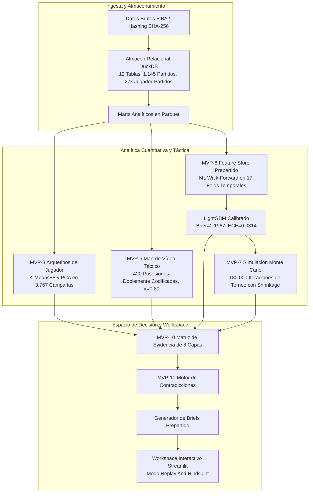

# Arquitectura del Sistema Analítico

## 1. Visión General
El sistema implementa una arquitectura desacoplada por capas que transforma registros brutos de partidos internacionales en evidencia estructurada y soporte a decisiones para cuerpos técnicos.



---

## 2. Capas de Almacenamiento y Datos

1. **Capa Bruta Inmutable (`data/01_raw/`)**:
   - Actas y boxscores históricos originales almacenados con firmas de integridad criptográfica SHA-256.
2. **Capa Certificada Relacional (`data/03_validated/basketball_analytics.duckdb`)**:
   - Base de datos relacional columnar DuckDB con 12 tablas normalizadas (`fact_game`, `fact_team_game`, `fact_player_game`, `dim_tournament`, `dim_team`, `dim_player`, etc.).
3. **Capa de Marts Analíticos (`data/04_marts/analytics/`)**:
   - Tablas Parquet optimizadas por columnas para consultas de alto rendimiento y entrenamiento de modelos.

---

## 3. Módulos Python en `src/analytics/`

- `mvp0_data_engineering.py`: Ingesta, parseo, reconciliación matemática de actas y carga en DuckDB.
- `mvp2_econometrics.py`: Modelado econométrico longitudinal de series temporales interrumpidas (ITS) sobre cambios de reglas FIBA.
- `mvp3_player_analytics.py`: Minería no supervisada de arquetipos funcionales de jugador mediante K-Means++ y PCA.
- `mvp4_recruitment_decision.py`: Modelos de ajuste posicional y compatibilidad táctica (Candidate Fit Index).
- `mvp5_video_validation.py`: Capa de validación cualitativa de vídeo y cálculo de fiabilidad inter-evaluador (Cohen's Kappa).
- `mvp6_supervised_analytics.py`: Machine Learning supervisado walk-forward en 17 folds, calibración isotónica e interpretabilidad TreeSHAP.
- `mvp7_tournament_simulation.py`: Motor de simulación Monte Carlo de cuadros de torneo (180.000 iteraciones con shrinkage).
- `mvp8_decision_system.py`: Integración de matrices de decisión prepartido y auditoría retrospectiva de decisiones.
- `mvp9_presentation_generator.py`: Generador automatizado de presentaciones ejecutivas y técnicas.
- `mvp10_analyst_workspace.py`: Aplicación web interactiva Streamlit con aislamiento anti-hindsight y motor de contradicciones.

---

## 4. Garantía Anti-Hindsight (Anti-Sesgo Retrospectivo)
El sistema garantiza que ninguna consulta analítica prepartido pueda acceder a datos con `game_date >= target_game_date`. Esto simula con total exactitud la posición de incertidumbre real a la que se enfrentaba el cuerpo técnico antes de comenzar el encuentro.

---

## 5. Arquitectura Dual-Stack: Python + R

El sistema integra de forma nativa dos entornos complementarios conectados directamente al almacén de datos DuckDB:

```text
                 ┌───────────────┐
                 │   Raw Data    │
                 │  (Boxscores)  │
                 └───────┬───────┘
                         │
                         ▼
                 ┌───────────────┐
                 │ Python / ETL  │
                 │  (QA Engine)  │
                 └───────┬───────┘
                         │
                         ▼
                 ┌───────────────┐
                 │    DuckDB     │
                 │ (OLAP Store)  │
                 └───────┬───────┘
                         │
              ┌──────────┴──────────┐
              ▼                     ▼
        ┌───────────┐         ┌───────────┐
        │  Python   │         │     R     │
        │ ML / Sim. │         │ Stats/EDA │
        └─────┬─────┘         └─────┬─────┘
              │                     │
              └──────────┬──────────┘
                         ▼
                ┌──────────────────┐
                │ Decision Support │
                │ (Briefs & Video) │
                └──────────────────┘
```

- **Python (`src/analytics/`)**: Ingesta de datos, control de calidad determinista, Machine Learning supervisado (LightGBM), simulaciones Monte Carlo y aplicación interactiva Streamlit.
- **R (`R/`)**: Exploratory Data Analysis (EDA), análisis longitudinal de trayectorias de carrera, distribuciones empíricas per-40, validación estadística independiente (bootstrap $B=5.000$ y permutación $P=10.000$) y generación de visualizaciones publicables con `ggplot2`.
