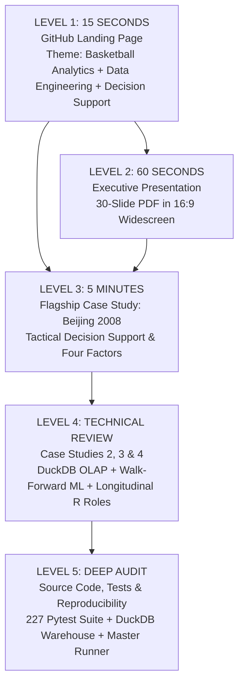

# Portfolio Conversion Funnel — International Basketball Analytics

This document defines the 5-level candidate engagement funnel for hiring managers, scouts, and technical recruiters visiting the `basketball-analytics` repository.

---

## The 5-Level Portfolio Architecture

---

### LEVEL 1 — 15 SECONDS: GitHub Landing Page

- **Entry Point**: [Repository Root README.md](https://github.com/miguelo0203/basketball-analytics)
- **Objective**: Instant visual confirmation of candidate credibility and focus.
- **Key Takeaways for Reviewer**:
  - *Who*: Miguel — Basketball Data Analyst.
  - *What*: Full-stack basketball analytics & decision-support system.
  - *Scale*: 20 years of FIBA tournaments (1,145 games, 27,353 player logs).
  - *Core Technologies*: Python, R, DuckDB, Parquet, Streamlit, Pytest.
- **Conversion Trigger**: Reviewer clicks on the Executive Presentation or Flagship Case Study.

---

### LEVEL 2 — 60 SECONDS: Executive Presentation Deck

- **Entry Point**: [presentation/International_Basketball_Analytics_Presentation.pdf](https://github.com/miguelo0203/basketball-analytics/blob/main/presentation/International_Basketball_Analytics_Presentation.pdf)
- **Objective**: High-level visual walkthrough of problem, methodology, tactical applications, and operational ROI.
- **Key Takeaways for Reviewer**:
  - 30 polished slides structured into 5 distinct modules.
  - Clear distinction between raw data, statistical inference, predictive ML, and coaching briefs.
  - Tangible visualization of shrinkage flows, tournament brackets, analyst mockups, and organizational value trees.
- **Conversion Trigger**: Reviewer wants to see the concrete evidence behind the tactical claims.

---

### LEVEL 3 — 5 MINUTES: Flagship Case Study (Beijing 2008 Final)

- **Entry Point**: [portfolio/case_studies/case_01_tactical_decision_support.md](https://github.com/miguelo0203/basketball-analytics/blob/main/portfolio/case_studies/case_01_tactical_decision_support.md)
- **Objective**: Demonstrate basketball fluency, tactical problem-solving, and communication with coaching staffs.
- **Key Takeaways for Reviewer**:
  - Breakdown of Spain vs. USA Olympic Final 2008.
  - Identification of half-court advantage ($+4.2$ Net Rating) vs. transition leakage ($1.25$ PPP).
  - Concrete tactical recommendations: pace control ($\le 72$ poss), 2-3 zone defense, pick-and-pop exploitation against center drop coverage.
  - Proof that the candidate understands actual on-court basketball dynamics.
- **Conversion Trigger**: Reviewer confirms basketball domain competence and moves to evaluate technical depth.

---

### LEVEL 4 — TECHNICAL REVIEW: Specialist Case Studies (15–20 Minutes)

- **Entry Point**: [portfolio/case_studies/README.md](https://github.com/miguelo0203/basketball-analytics/blob/main/portfolio/case_studies/README.md)
- **Objective**: Deep-dive validation across specialized technical disciplines.
- **Specialized Tracks**:
  - **Data Engineering**: [Case Study 2 — DuckDB OLAP & Medallion Architecture](https://github.com/miguelo0203/basketball-analytics/blob/main/portfolio/case_studies/case_02_data_engineering_olap_duckdb.md) (12 normalized tables, 200 min/game validation invariant, player deduplication).
  - **Machine Learning**: [Case Study 3 — Calibrated Walk-Forward ML](https://github.com/miguelo0203/basketball-analytics/blob/main/portfolio/case_studies/case_03_calibrated_ml_walk_forward.md) (17 expanding temporal folds, zero data leakage, Brier Score 0.1967, ECE 0.0314).
  - **Statistical Inference**: [Case Study 4 — Longitudinal Shooting & Role Mining](https://github.com/miguelo0203/basketball-analytics/blob/main/portfolio/case_studies/case_04_longitudinal_shooting_and_roles.md) (Bayesian shrinkage $\lambda=0.75$, cluster bootstrap $B=5,000$, 6 functional archetypes in R/Quarto).
- **Conversion Trigger**: Reviewer verifies advanced engineering and statistical maturity.

---

### LEVEL 5 — DEEP AUDIT: Source Code, Testing & Reproducibility

- **Entry Point**: `src/`, `R/`, `tests/`, and [REPRODUCIBILITY.md](https://github.com/miguelo0203/basketball-analytics/blob/main/REPRODUCIBILITY.md)
- **Objective**: Complete code audit and independent verification.
- **Key Takeaways for Reviewer**:
  - `python scripts/run_project.py` executes the entire pipeline end-to-end in ~2 minutes without cloud dependencies.
  - `python -m pytest tests -q` runs 227 automated unit/integration tests with 100% pass rate.
  - Fully typed, modular, clean Python and idiomatic R code.
- **Final Outcome**: **Immediate outreach / interview invitation.**
