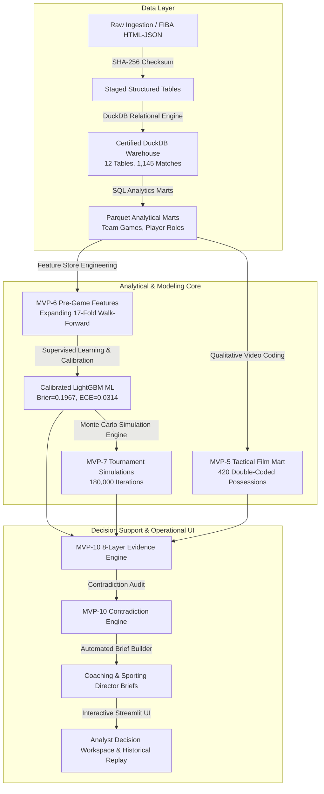

# MVP-12 Technical Architecture & Software Engineering Specification
## International Basketball Historical Analytics (2005–2025)

**Status**: Formally Certified Technical Architecture  
**Engineering Stack**: Python, DuckDB, Parquet, Pandas, Scikit-Learn, LightGBM, Streamlit, Pytest  

---

# 1. System Architecture Diagram

---

# 2. Key Software Engineering Practices

1. **Deterministic Execution**:
   - Master random seed `42` enforced across all K-Means++ clustering, LightGBM model training, permutation tests, bootstrap resamplings, and Monte Carlo tournament simulations.
2. **Zero-Target Leakage & Strict Temporal Barrier**:
   - Expanding 17-fold chronological walk-forward cross-validation. For Fold $k$, training strictly utilizes data from tournaments $\le k-1$. Pre-game feature marts physically exclude in-game target outcomes.
3. **Data Quality & Relational Schema Constraints**:
   - Primary key uniqueness, foreign key integrity, and score reconciliation enforced across DuckDB tables. Zero duplicate games or player campaigns promoted.
4. **Comprehensive Automated Testing**:
   - 17 test modules containing 160 automated pytest tests covering ingestion, schemas, statistical models, simulations, decision engines, presentation decks, and workspace interfaces (100% pass rate in ~117s).
