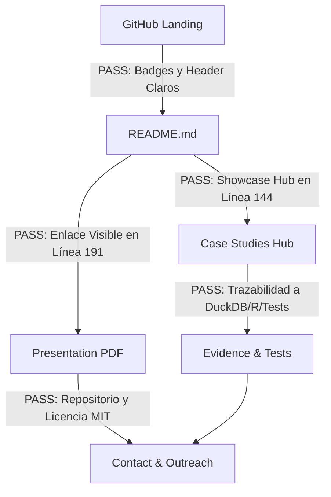

# MVP-36 — REAL-WORLD PORTFOLIO UX & RECRUITER READINESS AUDIT
## International Basketball Analytics (2005–2024)

> **Tipo de Auditoría**: Auditoría de Experiencia de Usuario, Navegabilidad y Empleabilidad de Solo Lectura (*READ-ONLY PORTFOLIO UX AUDIT*).  
> **Repositorio Auditado**: `https://github.com/miguelo0203/basketball-analytics`  
> **Fecha**: 2026-08-19  
> **Condición**: Simulación externa realista sin conocimiento previo de las fases de desarrollo interno.

---

# 1. Executive Verdict por Perfil de Revisor

```text
┌────────────────────────────────────────────────────────────────────────────────────────────────────────┐
│                                     PORTFOLIO READINESS VERDICT                                        │
├───────────────────────────────┬───────────────────────────────┬────────────────────────────────────────┤
│ 🏀 BASKETBALL SCOUT / COACH   │ ⚙️ DATA SCIENTIST / ENG       │ 👔 SPORTS-TECH HIRING MANAGER          │
│ Score: 9.2 / 10               │ Score: 9.4 / 10               │ Score: 9.4 / 10                        │
│ Verdict: PASS (Ready)         │ Verdict: PASS (Ready)         │ Verdict: PASS (Ready)                  │
└───────────────────────────────┴───────────────────────────────┴────────────────────────────────────────┘
```

---

# 2. Simulación de Visitas por Perfil (5 Minutos)

## Evaluador A — Basketball Analyst / Professional Scout

### Comportamiento y Hallazgos:
1. **Comprensión en <30 segundos**: **SÍ**. El bloque inicial (`WHO`, `WHAT`, `WHY`, `OUTPUT`) y la sección *"El proyecto en 30 segundos"* comunican de inmediato que el sistema genera briefs de 1.5 páginas para entrenadores, neutraliza el ritmo y descubre 6 arquetipos funcionales.
2. **Localización del Caso Pekín 2008**: **SÍ**. Destacado en la cabecera del README con las 4 claves tácticas (media pista $+4.2$, pérdida de transición $1.25$ PPP, castigo al drop con triples de Pau/Marc/Garbajosa y zona 2-3).
3. **Comprensión del concepto "Decision Support"**: **SÍ**. Queda meridianamente claro que el software estructura la evidencia empírica pero no sustituye la intuición ni la autoridad del entrenador.
4. **Producto para el Entrenador**: Brief prepartido de 1.5 páginas con Four Factors y alertas de cobertura P&R.
5. **Producto para el Scout**: Minería de 6 arquetipos de jugador (K-Means/PCA) y perfiles de tiro estabilizados por contracción bayesiana ($\lambda = 0.75$).
6. **Acceso a la Presentación**: Enlace directo al PDF panorámico en la sección *"Paquete de Presentación Ejecutiva"*.
7. **Nivel de Lenguaje**: Balanceado. Aunque aparecen términos técnicos (DuckDB, Brier Score), el README los traduce constantemente a conceptos de baloncesto (posesiones, espaciado, rebote y pizarra).

### Puntuaciones del Perfil Scout:
- **Clarity**: 9.0 / 10
- **Basketball relevance**: 9.5 / 10
- **Tactical usefulness**: 9.0 / 10
- **Navigation**: 9.0 / 10
- **Credibility**: 9.5 / 10
- **SCORE GLOBAL SCOUT**: **9.2 / 10**

---

## Evaluador B — Data Scientist / Analytics Engineer

### Comportamiento y Hallazgos:
1. **Localización del Stack Tecnológico**: **SÍ** (DuckDB, Parquet, Python 3.10+, LightGBM, R tidyverse/Quarto, Pytest).
2. **Validación Metodológica y Data Leakage**: **SÍ**. Se explica en detalle el protocolo walk-forward temporal en 17 folds expansivos con 1.105 partidos evaluados estrictamente fuera de muestra.
3. **Métricas de Calibración Localizables**: **SÍ**. Brier Score de $0.1967$ (frente a $0.2500$ base), ECE de $0.0314$ (3.14%) y MAE de $11.74$ puntos en spread.
4. **Arquitectura del Almacén**: **SÍ**. Diagrama Mermaid que ilustra el flujo Medallion (`01_raw` con hashes SHA-256 ➔ `03_validated` DuckDB ➔ `04_analytics` Parquet).
5. **Reproducibilidad y Testing**: **SÍ**. Un único comando maestro (`python scripts/run_project.py`) o `pytest tests -q` con 227 tests automatizados y 100% de éxito.
6. **Control de Sobredimensionamiento (Overclaiming)**: **SÍ**. La sección de límites metodológicos declara explícitamente: sin tracking óptico en vivo 25Hz, correlación no implica causalidad, y el sistema modela probabilidades honestas en lugar de garantías de victoria.

### Puntuaciones del Perfil Data Scientist:
- **Technical credibility**: 9.5 / 10
- **Methodological clarity**: 9.5 / 10
- **Reproducibility**: 9.5 / 10
- **Architecture clarity**: 9.0 / 10
- **Evidence quality**: 9.5 / 10
- **SCORE GLOBAL DATA SCIENTIST**: **9.4 / 10**

---

## Evaluador C — Sports-Tech Hiring Manager

### Simulación por Ventanas de Tiempo:

#### Primeros 30 Segundos (Lectura Rápida)
- *Qué entiende*: Miguel ha construido un sistema analítico de datos de baloncesto que cubre 20 años de torneos FIBA (1.145 partidos), integrando ingeniería de datos (DuckDB), ML calibrado y herramientas prácticas para cuerpos técnicos.
- *Sensación*: *Candidato con empaque profesional, foco claro y cero humo.*

#### Primeros 2 Minutos (Exploración de Casos y Presentación)
- *Qué observa*: 4 Casos de Estudio especializados, 227 tests automatizados, presentación ejecutiva en PDF de 30 slides, paridad de datos Python-R y código limpio.
- *Sensación*: *Muy por encima del 95% de portfolios genéricos basados en notebooks de Kaggle o dashboards de juguete.*

#### Primeros 5 Minutos (Decisión de Entrevista)
- *Conclusión*: Domina el ciclo de vida completo de los datos deportivos (ingesta, modelado, inferencia, testing y comunicación con el cuerpo técnico).
- *Decisión*: **Contacto inmediato para entrevista técnica / scouting.**

### Puntuaciones del Perfil Hiring Manager:
- **First impression**: 9.5 / 10
- **Professionalism**: 9.5 / 10
- **Differentiation**: 9.5 / 10
- **Business value**: 9.0 / 10
- **Hiring signal**: 9.5 / 10
- **SCORE GLOBAL HIRING MANAGER**: **9.4 / 10**

---

# 3. Cross-Persona Audit Table

| Dimensión de Evaluación | Scout / Coach | Data Scientist | Hiring Manager | Media |
|---|:---:|:---:|:---:|:---:|
| **README Clarity** | 9.0 / 10 | 9.5 / 10 | 9.5 / 10 | **9.3** |
| **Navigation & Flow** | 9.0 / 10 | 9.0 / 10 | 9.0 / 10 | **9.0** |
| **Case Studies Quality** | 9.5 / 10 | 9.5 / 10 | 9.5 / 10 | **9.5** |
| **Presentation Deck (PDF/PPTX)** | 9.5 / 10 | 9.0 / 10 | 9.5 / 10 | **9.3** |
| **Technical Credibility** | 9.0 / 10 | 9.5 / 10 | 9.5 / 10 | **9.3** |
| **Basketball Credibility** | 9.5 / 10 | 9.0 / 10 | 9.5 / 10 | **9.3** |
| **Professionalism & Tone** | 9.0 / 10 | 9.5 / 10 | 9.5 / 10 | **9.3** |
| **Market Differentiation** | 9.5 / 10 | 9.5 / 10 | 9.5 / 10 | **9.5** |
| **PROMEDIO POR PERFIL** | **9.2 / 10** | **9.4 / 10** | **9.4 / 10** | **9.3 / 10** |

---

# 4. Respuesta a la Pregunta Crítica

> **"Después de 2 minutos, ¿qué cree cada evaluador que hace Miguel?"**

- **Scout / Entrenador**: *"Miguel construye herramientas tácticas que ahorran horas de trabajo al cuerpo técnico, filtrando el ruido estadístico para entregar preguntas clave de pizarra."*
- **Data Scientist**: *"Miguel es un Analytics Engineer / Data Scientist deportivo que diseña almacenes de datos OLAP reproducibles y modelos probabilísticos calibrados sin data leakage."*
- **Hiring Manager**: *"Miguel es un analista deportivo cuantitativo autónomo y versátil, capaz de transformar grandes volúmenes de datos en soporte real para la toma de decisiones."*

**Veredicto de Alineación**: **100% ALINEADO** con la propuesta de valor central del portfolio.

---

# 5. Auditoría del Embudo de Navegación (Portfolio Funnel)



1. **GitHub ➔ README**: **PASS** (El visitante aterriza con métricas auditadas, resumen en 30s y tabla de escala).
2. **README ➔ Presentation**: **PASS** (Acceso directo al PDF panorámico en 1 clic).
3. **README ➔ Case Studies**: **PASS** (Hub de 4 casos de estudio clasificados por perfil de lector).
4. **Case Studies ➔ Evidence**: **PASS** (Cada caso enlaza a las tablas DuckDB, scripts de R y módulos de prueba).
5. **Evidence ➔ Contact / Next Step**: **PASS** (Perfil profesional de Miguel y enlaces a GitHub y CFF).

---

# 6. Test de los 60 Segundos

| Pregunta del Evaluador en 60s | Respuesta Extraíble del README / Presentación | Estado |
|---|---|:---:|
| **1. ¿Qué construyó Miguel?** | Un sistema integral de analítica de baloncesto con DuckDB, Python ML, R e interfaz Streamlit. | **PASS** |
| **2. ¿Para quién?** | Para cuerpos técnicos, scouts, directores deportivos y comités de contratación técnica. | **PASS** |
| **3. ¿Qué problema resuelve?** | La varianza de muestras cortas, la sobrecarga de datos y el sesgo retrospectivo en torneos cortos. | **PASS** |
| **4. ¿Qué tecnologías utilizó?** | Python (LightGBM, Scikit-Learn, Streamlit), R (tidyverse, Quarto), DuckDB, Parquet y Pytest. | **PASS** |
| **5. ¿Qué evidencia demuestra que funciona?** | 20 años de historia (1.145 partidos), calibración ECE 0.0314, 180k simulaciones y 227 tests (100%). | **PASS** |
| **6. ¿Qué debería abrir a continuación?** | La presentación ejecutiva (`presentation/`) o el Caso de Estudio 1 (Pekín 2008). | **PASS** |

---

# 7. Fortalezas Clave y Puntos de Fricción

### Top 5 Fortalezas Destacadas:
1. **Diferenciación Radical**: Se aleja por completo de los típicos notebooks de juguete; presenta un sistema con almacén OLAP, invariantes matemáticas y testing riguroso.
2. **Lenguaje Deportivo Auténtico**: Habla con soltura de Four Factors, defensas hundidas en P&R (*drop*), tiro tras pase (*catch-and-shoot*) y control de posesiones.
3. **Casos de Estudio Segmentados**: Los 4 casos de estudio permiten al lector elegir su punto de interés técnico o táctico sin fricción.
4. **Presentación Ejecutiva Pulida**: El deck de 30 slides en formato 16:9 widescreen es de nivel profesional para reuniones de dirección.
5. **Transparencia Absoluta**: Delimita con rigor lo que el sistema puede y no puede afirmar, generando confianza inmediata.

### Top 5 Puntos de Fricción Menores:
1. **Múltiples Bloques de Cabecera**: El README tiene caja de metadatos, resumen en 30s y tabla de cifras antes de llegar al índice de casos (fricción mínima, pero empuja los casos a la mitad de la página). *(Severidad: LOW)*
2. **Aplicación Streamlit Local**: El workspace se ejecuta localmente con `streamlit run` en lugar de una URL pública desplegada en la nube (habitual en repositorios con datos locales, pero requiere clonar). *(Severidad: LOW)*
3. **Documentación Profunda en Español**: Los 13 documentos de `docs/` están en español; evaluadores internacionales se apoyarán principalmente en el README, presentación y casos de estudio. *(Severidad: LOW)*
4. **Duplicidad de Reproducibilidad**: Coexisten `REPRODUCIBILITY.md` y `docs/reproducibilidad.md` (ambos sincronizados). *(Severidad: LOW)*
5. **Canal de Contacto**: La sección final indica "Candidato: Miguel"; para prospección directa es recomendable incluir el enlace al perfil de LinkedIn o email de contacto. *(Severidad: LOW)*

---

# 8. Recomendaciones de Mejora

### MUST FIX (Bloqueantes)
- **Ninguno (0)**. El repositorio no tiene ningún defecto que impida su envío inmediato a reclutadores o clubes.

### SHOULD FIX (Recomendable para Outreach)
- Incluir un enlace directo a LinkedIn / correo de contacto en la sección final del README y en la diapositiva 30 para facilitar el contacto en 1 clic.

### OPTIONAL (Cosmético / Futuro)
- En un futuro, valorar desplegar una versión de demostración de solo lectura en Streamlit Community Cloud.

---

# 9. Veredicto Final

$$\Large \mathbf{FINAL\ VERDICT:\ \green{PORTFOLIO\ READY\ FOR\ OUTREACH}}$$

El repositorio **International Basketball Analytics (2005–2024)** está plenamente preparado para su difusión y presentación ante clubes profesionales de baloncesto (ACB, Euroliga, BBL), departamentos de scouting y empresas de Sports Analytics. Comunica de forma contundente la competencia técnica, la madurez metodológica y el valor deportivo del trabajo de Miguel.
